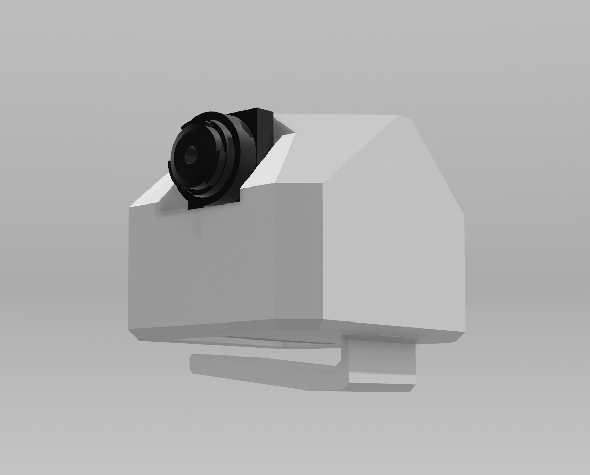
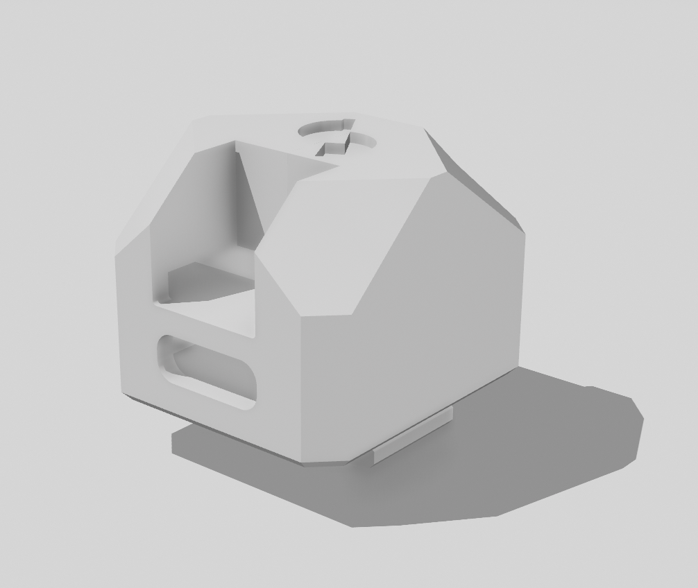

# Hardware Guide - SidekickOS

## 🔧 **Required Hardware**

### **Primary Components**

#### **XIAO ESP32S3 Sense**
- **MCU**: ESP32-S3 dual-core processor @ 240MHz
- **Memory**: 8MB PSRAM, 8MB Flash
- **Camera**: OV2640 2MP camera sensor
- **Microphone**: PDM digital microphone
- **Connectivity**: WiFi 802.11 b/g/n, Bluetooth 5.0 BLE
- **Size**: 21×17.5mm (ultra-compact)
- **Power**: USB-C charging, 3.7V battery connector

**Purchase Links:**
- [Seeed Studio Official](https://www.seeedstudio.com/XIAO-ESP32S3-Sense-p-5639.html)
- [Amazon](https://amazon.com/dp/B0C69FFVHH)
- [Adafruit](https://www.adafruit.com/product/5426)

#### **Glasses Frame**
- Any standard eyeglasses frame

#### **3D Printable Mount**
- **📁 Hardware Files**: Available in [`../hardware/`](../hardware/) directory
- **🖨️ 3D Print Ready**: STL and 3MF files included
- **🔧 CAD Model**: STEP file for modifications
- **📸 Visual Reference**: Front and back render images

### **Optional Components**

#### **Battery Pack**
- **Capacity**: 100-500mAh recommended
- **Voltage**: 3.7V Li-Po battery
- **Size**: Small enough to fit in glasses arm or pocket

**Recommended Batteries:**
- Small form factor Li-Po batteries
- Capacity depends on use case and mounting solution

#### **Mounting Hardware**
- Mounting solutions currently in development
- Hardware assembly documentation coming soon

## 🔌 **Wiring and Connections**

**Note**: All pins are pre-configured in the firmware. No external wiring required for basic functionality.

## 🔋 **Power Management**

### **Power Consumption**
- **Idle**: ~50mA
- **Camera Active**: ~150-200mA
- **BLE Streaming**: ~200-250mA
- **Peak Usage**: ~300mA

### **Battery Life Estimates**
Battery life depends on:
- Camera resolution and quality settings
- Frame rate and streaming frequency
- Audio streaming usage (when implemented)
- BLE connection activity

Typical usage with optimized settings: 2-8 hours depending on battery capacity and usage patterns.

### **Power Optimization Tips**
- Use deep sleep between captures
- Reduce frame rate for longer battery life
- Lower camera resolution when possible
- Disable audio streaming when not needed

## 🏗️ **Mechanical Design**

### **3D Printable Mounting Solution**

**Available Hardware Files:**
- **CAD Model**: [`../hardware/SidekickOS-ESP32S3-v1.step`](../hardware/SidekickOS-ESP32S3-v1.step) - Full 3D model (STEP format)
- **3D Print Ready**: 
  - [`../hardware/SidekickOS-ESP32S3-v1-print.stl`](../hardware/SidekickOS-ESP32S3-v1-print.stl) - STL format
  - [`../hardware/SidekickOS-ESP32S3-v1-print.3mf`](../hardware/SidekickOS-ESP32S3-v1-print.3mf) - 3MF format (recommended)

**Hardware Renders:**
| Front View | Back View |
|------------|-----------|
|  |  |

### **Mounting Features**

The SidekickOS ESP32S3 v1 mount includes:

- **Glasses Frame Integration**: Designed to clip onto standard eyeglass frames
- **Secure Camera Positioning**: Optimized positioning for the OV2640 camera sensor
- **ESP32S3 Housing**: Custom fit for the XIAO ESP32S3 Sense module
- **Access Ports**: USB-C port access for programming and charging

### **3D Printing Specifications**

**Recommended Settings:**
- **Layer Height**: 0.2mm
- **Infill**: 20-30%
- **Support**: Required for overhangs
- **Material**: PLA or PETG recommended
- **Print Orientation**: Follow 3MF file orientation

**Print Time**: Approximately 30 minutes to 1 hour depending on settings

## 📐 **Dimensions and Clearances**

### **XIAO ESP32S3 Sense Dimensions**
- Length: 21mm
- Width: 17.8mm
- Height: 15mm (with camera)
- Weight: ~5g

### **Mounting Clearances**
- Camera field of view: 66° diagonal
- Minimum clearance from lens: 15mm
- Recommended mounting height: 5-10mm above frame
- USB-C access: 10mm clearance needed

## 🔧 **Assembly Instructions**

### **3D Printing the Mount**

1. **Download Files**: Get the 3D print files from the [`../hardware/`](../hardware/) directory
2. **Print Settings**: Use the recommended settings above (0.2mm layer height, 20-30% infill)
3. **Support Material**: Enable supports for overhangs
4. **Post-Processing**: Remove supports and sand rough edges if needed

### **Hardware Assembly**

**Step 1: Prepare the ESP32S3**
1. Flash the SidekickOS firmware to your XIAO ESP32S3 Sense
2. Test basic functionality using the serial monitor
3. Verify camera and BLE functionality

**Step 2: Mount Assembly**
1. Carefully insert the ESP32S3 Sense into the 3D printed mount
2. Ensure the camera lens aligns with the mount opening
3. Verify USB-C port accessibility for charging/programming
4. Check that the mount securely holds the device

**Step 3: Glasses Integration**
1. Identify the best mounting position on your glasses frame
2. Clip or attach the mount to the glasses frame
3. Ensure the camera has an unobstructed view
4. Test comfort and stability during movement

**Step 4: Final Testing**
1. Connect via Python or Web client
2. Test camera capture and streaming
3. Verify comfortable fit during extended wear
4. Adjust mounting position if needed

### **Tools Required**
- 3D printer (or access to 3D printing service)
- Basic hand tools for post-processing
- Your favorite glasses frame
- XIAO ESP32S3 Sense module

## 🛡️ **Safety Considerations**

### **Electrical Safety**
- Use proper Li-Po battery handling procedures
- Avoid short circuits
- Monitor battery temperature during charging
- Use appropriate fuses if modifying power circuits

### **Mechanical Safety**
- Ensure secure mounting to prevent device falling
- Avoid sharp edges in 3D printed parts
- Test comfort during extended wear
- Consider impact resistance for active use

### **Privacy and Legal**
- Check local laws regarding recording devices
- Consider privacy implications of camera/microphone
- Add visible indicators when recording
- Respect others' privacy in public spaces

## 🔍 **Troubleshooting**

### **Common Hardware Issues**

| Problem | Possible Cause | Solution |
|---------|----------------|----------|
| Camera not working | Loose connection | Check camera ribbon cable |
| Poor image quality | Lens dirty/scratched | Clean lens, check for damage |
| Short battery life | High power consumption | Optimize firmware settings |
| BLE connection issues | Interference | Check for 2.4GHz interference |
| Charging problems | Faulty USB cable | Try different USB-C cable |

### **Hardware Testing**

```bash
# Flash test firmware
cd firmware
idf.py flash monitor

# Check hardware status in serial output
# Look for:
# - Camera initialization success
# - I2S/microphone setup
# - BLE advertising start
# - Memory allocation success
```

## 📞 **Hardware Support**

- **XIAO ESP32S3 Documentation**: [Seeed Studio Wiki](https://wiki.seeedstudio.com/xiao_esp32s3_getting_started/)
- **ESP32S3 Datasheet**: [Espressif Official](https://www.espressif.com/sites/default/files/documentation/esp32-s3_datasheet_en.pdf)
- **Hardware Issues**: Open GitHub issue with hardware tag
- **Community**: Join discussions for hardware modifications and improvements

---

**Ready to build your own smart glasses? Let's get started! 🤓🔧** 